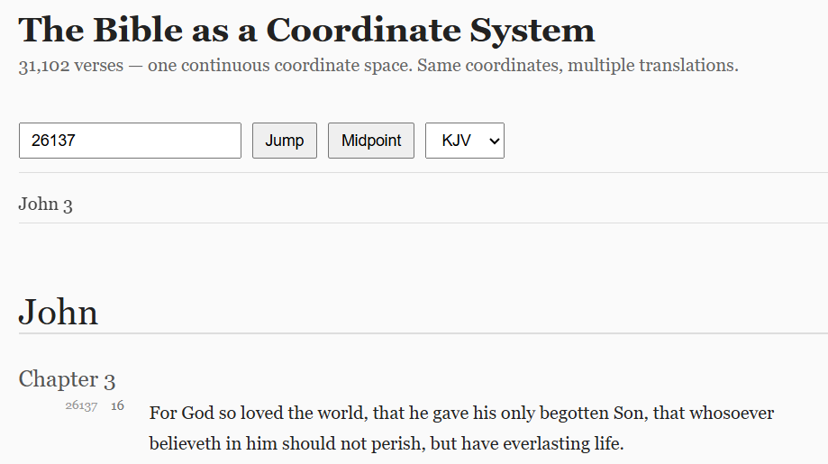

# Bible Coordinate System




## 31,102 verses — one continuous coordinate space.

Same coordinates, multiple translations.

> A translation-independent indexing model for Scripture, applicable to any Bible translation with a consistent verse mapping (e.g., the standard 66-book canon with 31,102 verses).

Instead of navigating by book → chapter → verse, Scripture is modeled as a single ordered index of verses, where every verse has a stable, translation-independent coordinate.

---

## What This Is

A minimal interface demonstrating the coordinate model applied to a real text corpus.

The goal is not to replace traditional references, but to provide a stable underlying index for retrieval, search, and AI systems.

---

## Demo

* Jump to any verse by index (e.g. `26137`)
* Or use references (`John 3:16`, `요 3:16`, etc.)
* Switch translations while staying at the same coordinate
* Infinite scroll through the entire Bible

---

## Concept

This reframes the Bible from a hierarchical structure into a linear addressable space.

Each verse is assigned a unique `verse_index`:

```
John 3:16 → 26137
```

This enables:

* Translation-independent retrieval
* Deterministic context windows
* Consistent indexing for AI / search systems

Example:

```
{ "verse_index": 26137 }
```

You can also construct context windows:

```
26137 ± 2
```

---

## Setup

This demo requires a free API key from HolyBible.dev.

1. Sign up → https://holybible.dev/signup
2. Copy your API key
3. Open the app and paste it when prompted

Your key is stored locally in your browser.

---

## Usage

* Enter a verse index:

  ```
  26137
  ```

* Or a reference:

  ```
  John 3:16
  요 3:16
  ```

* Click **Midpoint** to jump to the center of Scripture

---

## Supported Inputs

Basic alias normalization (demo-level):

* English: `John`, `Matthew`, `Genesis`
* French: `Jean`, `Matthieu`, `Genèse`
* Korean: `요`, `마`, `창`, `시`

Not a full reference parser — just enough to demonstrate the coordinate model.

---

## How It Works

* Fetches verses via API in chunks
* Uses `verse_index` as the primary coordinate
* Maintains position across translation changes
* Lazy-loads content using IntersectionObserver

---

## Why This Matters

Traditional references are hierarchical and translation-dependent.

A coordinate model enables:

* Stable IDs across all translations
* Better indexing for databases and search
* Clean grounding for AI systems
* Deterministic retrieval without ambiguity

---

## Tech

* Vanilla HTML / CSS / JS
* No framework
* IntersectionObserver for infinite scroll
* LocalStorage for API key

---

## License

MIT
